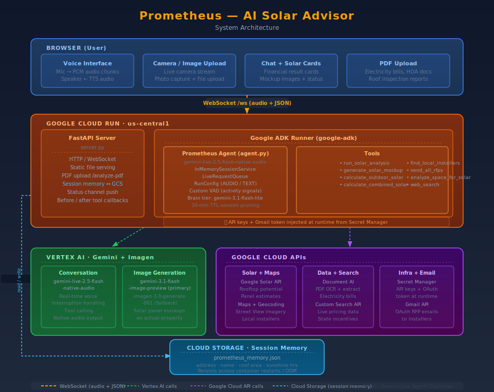

# Prometheus - AI Solar Advisor

> A real-time multimodal AI agent that guides homeowners through every step of going solar - from rooftop analysis and financial modelling to photorealistic mockups and installer quote requests - using voice, vision, and live Google data.

---

## What It Does

Prometheus is a **Live Agent** built on the Gemini Live API and Google ADK. Users speak naturally with it (hands-free, interruptible) while it:

- **Analyses their roof** via the Google Solar API - panels, annual production, payback period, federal + state incentives
- **Models outdoor alternatives** - solar canopies and ground-mount systems with full financial breakdowns
- **Generates photorealistic mockups** of panels on the user's actual property using Imagen 3 / Gemini image models
- **Accepts camera and photo input** so users can show their outdoor space for spatial analysis
- **Parses uploaded documents** - electricity bills, HOA rules, roof inspection reports - via Document AI
- **Finds local installers** via Google Maps and sends personalised RFP emails via Gmail

All tool activity is narrated with real-time step-by-step status messages. Results appear as structured cards in the chat window while the agent voices a spoken summary.

---

## Architecture



See `architecture.svg` for the full system diagram.

**Key components:**

| Layer | Technology |
|---|---|
| Frontend | Vanilla JS + WebSocket client (served by FastAPI) |
| Backend | FastAPI + `google-adk` ADK Runner on **Google Cloud Run** |
| Voice model | `gemini-live-2.5-flash-native-audio` via **Vertex AI** |
| Reasoning | `gemini-3.1-flash-lite-preview` (Brain tier, parallel calls) |
| Image generation | `gemini-3.1-flash-image-preview` → Imagen 3 fallback |
| Solar data | **Google Solar API** |
| Geocoding / Maps | **Google Maps Platform** |
| Document parsing | **Google Document AI** |
| Secrets | **Google Secret Manager** |
| Session memory | **Google Cloud Storage** (persists across container restarts) |
| Deployment | **Cloud Run** + Artifact Registry + Cloud Build |

---

## Prerequisites

- Python 3.11+
- [Google Cloud SDK](https://cloud.google.com/sdk/docs/install) (`gcloud` CLI)
- A Google Cloud project with billing enabled
- The following APIs enabled in your project:
  - Vertex AI API
  - Google Solar API
  - Maps JavaScript API + Geocoding API
  - Google Custom Search API
  - Document AI API (optional - for PDF parsing)
  - Gmail API (for RFP emails)
  - Secret Manager API
  - Cloud Run API + Artifact Registry API
  - Cloud Storage API (for persistent session memory)

---

## Local Development Setup

### 1. Clone the repository

```bash
git clone <your-repo-url>
cd prometheus-agent
```

### 2. Create and activate a virtual environment

```bash
python -m venv .venv

# Windows
.venv\Scripts\activate

# macOS / Linux
source .venv/bin/activate
```

### 3. Install dependencies

```bash
pip install -r requirements.txt
```

### 4. Set environment variables

Create a `.env` file in the `app/` directory (never commit this):

```env
GOOGLE_CLOUD_PROJECT=your-gcp-project-id
GOOGLE_CLOUD_LOCATION=us-central1
GOOGLE_GENAI_USE_VERTEXAI=1

MAPS_API_KEY=your-google-maps-api-key
GOOGLE_SEARCH_API_KEY=your-custom-search-api-key
GOOGLE_SEARCH_ENGINE_ID=your-search-engine-id
DOCUMENT_AI_PROCESSOR_ID=your-document-ai-processor-id
SENDER_EMAIL=your-gmail-address@gmail.com
```

### 5. Authenticate with Google Cloud

```bash
gcloud auth application-default login
gcloud config set project your-gcp-project-id
```

### 6. Set up Gmail OAuth (for RFP email sending)

```bash
cd app
python auth_test.py
```

This opens a browser window - log in with your Gmail account and grant access. It writes `token.pickle` to the `app/` directory.

### 7. Run the server

```bash
cd app
python server.py
```

Open your browser at **http://localhost:8080**

---

## Cloud Deployment

Deployment is fully automated via a CI/CD pipeline - every `git push origin main` builds and deploys automatically. The steps below are **one-time setup only**.

### Step 1 - Provision infrastructure (Terraform)

Run once in Google Cloud Shell (Terraform is pre-installed):

```bash
cd terraform
terraform init
terraform plan
terraform apply   # type 'yes' when prompted
```

This creates the Cloud Run service, Service Account, IAM roles, and Artifact Registry repository.

### Step 2 - Store secrets in Secret Manager

```bash
# Fix Windows line endings if running locally
sed -i 's/\r//' setup_secrets.sh

bash setup_secrets.sh
```

This stores `MAPS_API_KEY`, `GOOGLE_SEARCH_API_KEY`, `GOOGLE_SEARCH_ENGINE_ID`, `DOCUMENT_AI_PROCESSOR_ID` in Secret Manager.

Then upload the Gmail OAuth token:

```bash
base64 app/token.pickle > token_b64.txt
gcloud secrets create GMAIL_TOKEN --data-file=token_b64.txt
gcloud projects add-iam-policy-binding YOUR_PROJECT_ID \
  --member="serviceAccount:prometheus-sa@YOUR_PROJECT_ID.iam.gserviceaccount.com" \
  --role="roles/secretmanager.secretAccessor"
```

### Step 3 - Connect GitHub → Cloud Build (one-time, 5 minutes)

1. Go to [console.cloud.google.com/cloud-build/triggers](https://console.cloud.google.com/cloud-build/triggers)
2. Click **Connect Repository** → select **GitHub**
3. Authenticate → select your repo → click **Install Google Cloud Build**
4. Click **Create Trigger** with these settings:
   - Event: **Push to a branch**
   - Branch: `^main$`
   - Configuration: **Cloud Build configuration file** → `cloudbuild.yaml`
5. Click **Save**

### Step 4 - Deploy

```bash
git push origin main
```

That's it. Every push to `main` automatically builds a fresh Docker image and deploys a new Cloud Run revision - zero manual steps required.

> **Manual deploy (optional fallback):** If you need to deploy without a git push, run `bash deploy.sh` from Google Cloud Shell.

---

## Project Structure

```
prometheus-agent/
├── app/
│   ├── server.py               # FastAPI app, WebSocket handler, ADK runner
│   ├── Prometheus/
│   │   └── agent.py            # ADK Agent definition + system prompt
│   ├── brain.py                # Parallel Gemini reasoning + image generation
│   ├── solar_api.py            # Google Solar API + Maps geocoding
│   ├── solar_mockup.py         # Photorealistic panel mockup generation
│   ├── outdoor_solar_tool.py   # Canopy / ground-mount financial calculations
│   ├── combined_solar_tool.py  # Combined rooftop + outdoor analysis
│   ├── find_installers.py      # Google Maps local installer search
│   ├── rfp_generator.py        # Personalised RFP email generation
│   ├── send_rfp_email.py       # Gmail API sender (OAuth via Secret Manager)
│   ├── image_analysis.py       # Gemini vision - outdoor space analysis
│   ├── tax_benefits.py         # Federal ITC + live state incentive lookup (Custom Search + Brain fallback)
│   ├── search_tool.py          # Google Custom Search web tool
│   ├── session_memory.py       # Persistent session memory - GCS-backed on Cloud Run, local file in dev
│   ├── status_channel.py       # Real-time status push to browser
│   └── static/
│       └── index.html          # Single-page frontend (voice UI + chat)
├── Dockerfile
├── .dockerignore
├── requirements.txt
├── deploy.sh                   # Automated Cloud Run deployment
├── setup_secrets.sh            # Secret Manager one-time setup
├── architecture.svg            # System architecture diagram
└── README.md
```

---

## Technologies Used

- **[Google ADK](https://google.github.io/adk-docs/)** - Agent orchestration, tool callbacks, session management
- **[Gemini Live API](https://ai.google.dev/gemini-api/docs/live)** - Real-time bidirectional audio (`gemini-live-2.5-flash-native-audio`)
- **Gemini image models** - `gemini-3.1-flash-image-preview` for solar mockup generation
- **Imagen 3** - `imagen-3.0-generate-001` fallback for photorealistic mockups
- **Google Solar API** - Rooftop solar potential, panel counts, energy production estimates
- **Google Maps Platform** - Geocoding, Street View imagery, Places for local installers
- **Google Document AI** - OCR and structured extraction from uploaded PDFs
- **Google Custom Search API** - Live web search for pricing and incentives
- **Gmail API** - OAuth-authenticated RFP email delivery
- **Google Cloud Run** - Serverless container hosting
- **Google Secret Manager** - Runtime secret injection (API keys, OAuth tokens)
- **Google Artifact Registry** - Docker image storage
- **FastAPI + WebSocket** - Backend server and real-time browser communication

---

## Key Features

- 🎙️ **Real-time voice** - Interruptible conversation via Gemini Live native audio
- 📷 **Camera + image input** - Point at your outdoor space for AI spatial analysis
- ☀️ **Live solar data** - Real rooftop data from Google Solar API for your exact address
- 🏗️ **AI-generated mockups** - See what panels look like on your actual property
- 📄 **Document upload** - Drop in your electricity bill; the agent reads it automatically
- 📧 **Automated RFP emails** - Agent drafts and sends personalised quote requests to installers
- 💰 **Full financial breakdown** - Cost, savings, payback, ITC, and live state incentives (Custom Search + Brain fallback) in one card
- 🔄 **Session memory** - Remembers your address, roof data, and name across reconnects via GCS (survives container restarts)
- 🧹 **Auto-pruning session cache** - Background task evicts ADK sessions idle for 30+ minutes to prevent memory growth on Cloud Run

---

## Infrastructure as Code (CI/CD Pipeline)

The entire cloud infrastructure is defined in code - no manual console clicks required after the first-time secret setup.

### How it works

```
git push origin main
        │
        ▼
 Cloud Build Trigger  ──►  cloudbuild.yaml
                                │
                    ┌───────────┼───────────┐
                    ▼           ▼           ▼
               docker build   docker push  gcloud run deploy
               (image)        (Artifact    (Cloud Run -
                               Registry)    new revision)
```

Every `git push` to `main` automatically builds a fresh Docker image tagged with the commit SHA and deploys it to Cloud Run - zero manual steps.

### Files

| File | Purpose |
|---|---|
| `terraform/main.tf` | Defines Cloud Run service, Service Account, IAM roles, Artifact Registry, GCS memory bucket, and API enablement |
| `terraform/variables.tf` | Project ID, region, service name, image path |
| `terraform/outputs.tf` | Outputs the live Cloud Run URL after apply |
| `cloudbuild.yaml` | 3-step CI/CD pipeline: build → push → deploy, triggered on every push to `main` |

### First-time Terraform setup

```bash
# Install Terraform (if not already installed)
# Windows:  winget install HashiCorp.Terraform  (or use Google Cloud Shell - pre-installed)
# macOS:    brew install terraform
# Linux:    https://developer.hashicorp.com/terraform/install

cd terraform
terraform init
terraform plan   # review what will be created
terraform apply  # provision everything
```

Terraform manages:
- Cloud Run service configuration (secrets, env vars, scaling, timeout)
- Service Account and all IAM role bindings
- Artifact Registry repository
- Required API enablement
- Public (`allUsers`) invoker policy
- GCS bucket for session memory persistence across container restarts

### Ongoing deploys

After the one-time setup above, deploying is simply:

```bash
git push origin main
```

Cloud Build picks it up automatically, builds the image, and rolls out a new Cloud Run revision.

---

## Hackathon

Built for the **Gemini Live Agent Challenge** - Category: **Live Agents 🗣️**
